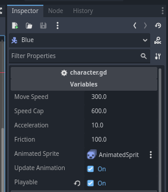

# PartyCharacterFramework
A modular Godot 4.x plugin that offers a **party and character control system** with **built-in character–NPC scripting**.

Designed for **RPG-style games** where you control one playable character and up to **4 dynamic NPC followers**, with smooth follower logic, party switching, and positional syncing. Perfect for games where party coordination, character switching, and AI follower behavior are key.

## Available Functions

### `PartyManager.add_to_party(npc: CharacterBody2D)`

Adds an NPC to the party if there is room.

- Sets `is_on_party = true` and defines `party_position`.
- Calls `place_in_party_position()` to auto-position the NPC.
- Will not add the NPC if it’s already in the party.
- Limit: 4 members besides the player. (Customizable)

### `PartyManager.remove_from_party(npc: CharacterBody2D)`

Removes an NPC from the party.

- Sets `is_on_party = false` and `party_position = -1`.
- Reorganizes remaining members using `reorganize_party()`.

### `PartyManager.play_as(character: CharacterBody2D)`

Switches player control to the selected character.

- If another character is already playable, they switch places.
- Updates `party_members` order.
- Changes character's group from `npcs` to `player`.
- Repositions all members with `place_in_party_position()`.
- Alternatively you can set your player node (with the `character.gd` script) as "playable" on the inspector!

### `PartyManager.reorganize_party()`

Reassigns `party_position` to all party members  
and teleports them into correct formation using `place_in_party_position()`.

## Movement Logic

- NPCs follow the character ahead of them using dynamic positioning.
- Follow distance is calculated based on `party_position`.
- If too far, they teleport to the correct position.
- The member in position `1` always follows the currently playable character (`current_character[0]`).

## Requirements

- [Godot Engine 4.4.x](https://godotengine.org/)
- Set up the keys "move_up", "move_down", "move_right", "move_left, and "run".
- Characters must:
  - Use `$AnimatedSprite2D` for animations
  - Animation must have "idle", "up", "down", "left" and "right"
  - Move using `velocity`
  - Inherit from `CharacterBody2D`

## Setup

1. **Plugin Installation**
   - Copy the `PartyManagerFramework` folder into your project under:  
	 `res://addons/PartyManagerFramework/`
   - In the Godot Editor, go to **Project > Project Settings > Plugins**.  
   - Find `PartyManagerFramework` in the list and set it to **Active**.

2. **Character Setup**
   - Attach the `character.gd` script to any character nodes that should be managed by the party system.  
   - Alternatively, you can use your own custom script, as long as it follows the same structure of variables and functions.

3. **Gameplay Usage**
   - Use the following main methods inside your gameplay logic or UI:
	 - `PartyManager.add_to_party(character)` → adds a character to the party.
	 - `PartyManager.play_as(character)` → sets the active playable character.

4. **Advanced Configuration**
   - To change the maximum number of party members, edit the `max_party_members` variable directly inside the `partymanager.gd` script.  
   - Alternatively, you can add the custom **PartyManager** node to your scene to override settings for that specific scene.

5. **Done!**
   - The Party Manager Framework is now ready to use in your project!

## Video Demo
https://github.com/user-attachments/assets/041dbe64-e91f-4da0-ab55-8620c10ae647

You can find the demo scene inside the [demo folder](https://github.com/GabrielOlivierDEV/PartyManagerFramework/tree/main/demo) of this project.

## Note from the Author.

This plugin was initially developed for a JRPG project that never fully came to life. While the code may be a bit amateur, I hope it can still be useful in your game development journey. If you find ways to improve it or want to add new features, feel free to submit your contributions here!

## License

**PartyManagerFramework** is an open-source project. You are free to use, modify, and distribute the code under the terms of the [MIT License](https://opensource.org/licenses/MIT).
